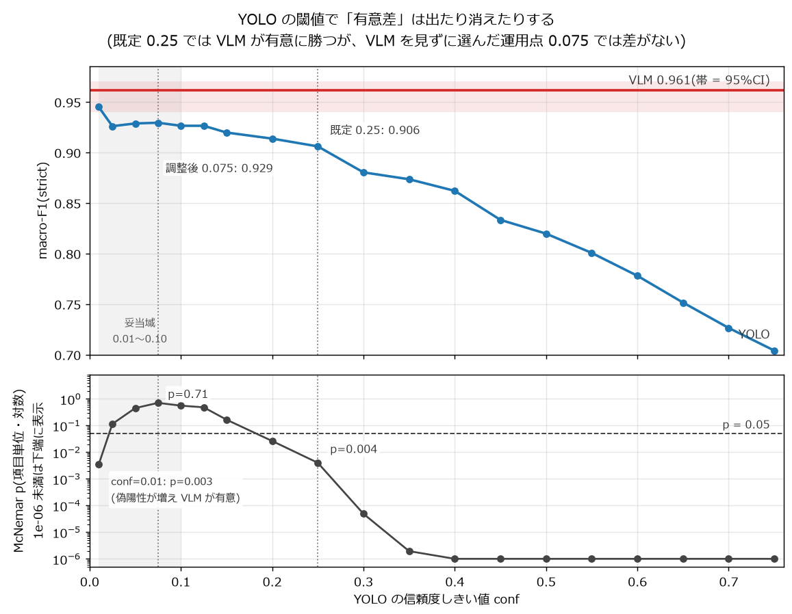
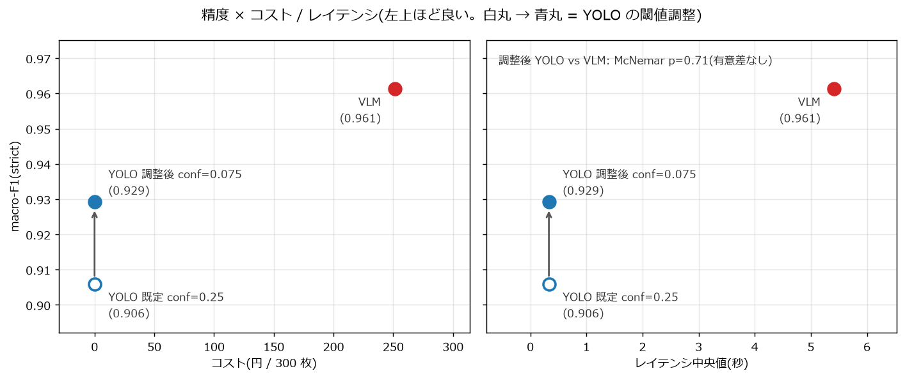

# vlm-vs-yolo

画像に「期待される項目」が写っているかを判定するタスクで、汎用の視覚言語モデル(VLM, Gemini Flash)と
専用検出器(YOLO)のどちらを採るべきかを、COCO val2017 の 300 枚で統計的に検証した比較評価フレームワーク。

## 結論

1. **閾値を公平に調整しないと、有意差は捏造される。** YOLO を既定 conf=0.25 のまま比べると VLM が有意に
   勝つ(McNemar p=0.004)が、VLM を見ずに選んだ運用点 conf=0.075 では p=0.71 で有意差なし。妥当な閾値域
   (0.01〜0.10)全体で、YOLO の macro-F1 は 0.921〜0.945、VLM は 0.961 と差は数 pt に収まる。
2. 精度が互角なら、決め手はコストとレイテンシ。YOLO は無料で約 16 倍速(中央値 0.33 秒 vs 5.42 秒)。
   ただし検出語彙の外にある対象・ラベルの無いドメインでは YOLO は構造的に判定できず、ゼロショットの VLM が
   唯一の現実解になる。
3. **固定費先行の YOLO が従量課金の VLM を逆転する損益分岐は、公開値で最も安い条件でも累計 41 万枚**
   (アノテーション費を 0 円にしても約 29 万枚)。PoC 規模(月 数百〜数千枚)では回収できず、固定費を 10 倍に
   振っても向きは変わらない。





- 記事: [前編(背景)](https://zenn.dev/yuya0408/articles/yolo-vs-vlm-background) /
  [後編(評価の落とし穴)](https://zenn.dev/yuya0408/articles/yolo-vs-vlm-evaluation-pitfall)
- 詳細な分析と図表: [report/REPORT.md](report/REPORT.md)
- 設計: [docs/DESIGN.md](docs/DESIGN.md)

## なぜ作ったか

実務で、画像から「期待される項目が写っているか」を判定する機能に汎用 VLM を選んだ。根拠は 3 つ
——(1) 学習用のアノテーションがほとんど無い、(2) PoC として小さく始めるので初期固定費を抱えたくない、
(3) 応答速度への要求が緩い。

判断自体は妥当だったと思うが、当時それを支えていたのは実測ではなく見込みで、「どの条件が崩れたら判断が
反転するのか」を持っていなかった。そこで社内データを一切使わず、公開データ(COCO)で同じ意思決定を
再実行できる検証台を作った。成果物は「YOLO か VLM か」という答えではなく、**どの条件でどちらに倒すかと
いう意思決定ルール**である。

| 実務での根拠 | 本リポでの検証 |
|---|---|
| アノテーションが無い | 語彙外・ラベル無しでは YOLO は構造的に判定不能(REPORT §7・付録) |
| PoC で小さく始める | 損益分岐: PoC 規模では YOLO の固定費を回収できない(§5b) |
| 応答性が要らない | YOLO の優位(無料・約16倍速)が効かない条件。精度は互角(§1・§2) |

根底にあるのは、代替可能な AI コンポーネントのどちらを採るかを感想ではなく統計的な検証で決める、という
技術選定の型で、推論エンジンや API 基盤の選定にもそのまま使える。

## 比較を「有無判定」に揃える

YOLO の素の出力は bbox 検出だが、そのまま比べると座標精度の勝負になり VLM を不当に不利にする。そこで
比較を画像レベルのカテゴリ有無に還元した。

- YOLO: そのカテゴリを信頼度しきい値以上で 1 個でも検出したかで `present` / `absent` に還元(bbox 座標は使わない)
- VLM: `present` / `absent` / `uncertain` を返す
- 両者を同じ統計機構で突き合わせる。YOLO は `uncertain` を持たない 2 値判定とし、VLM だけが不確実性を
  表現できる点自体を観察対象にする(詳細は [docs/DESIGN.md](docs/DESIGN.md))

## 評価設計の要点

- **データ**: COCO val2017 から N=300 を層化サンプリング(物体数・最小 bbox 面積比)。正解はアノテーション
  から機械的に決まる。チェックリストは COCO 80 クラスに収まり、negative 項目には混同しやすいカテゴリ
  (dog↔cat、car↔truck 等)を意図的に混ぜる
- **統計**: 画像単位ブートストラップ 95% CI、対応ありの McNemar 検定、誤り要因のロジスティック回帰
- **閾値の選び方**: YOLO の運用点は F1 ピーク・リークなしの tune/test 分割・argmax の 3 基準が一致する
  conf=0.075。VLM の結果は選定に使っていない(REPORT §2)
- **VLM 側の対称性チェック**: プロンプトを 3 水準振っても結論は不変。ばらつきは macro-F1 で 0.46pt と、
  YOLO の閾値バンド幅 2.4pt より小さい(REPORT §2b)
- **uncertain**: VLM は `uncertain` を返せるが実際にはほぼ使わない(0.31%)。校正された不確実性は表現しない(REPORT §4)
- **損益分岐**: 「YOLO = 0 円」は API 課金が 0 という意味でしかない。アノテーション・学習工数・運用を固定費と
  して積み、従量課金の VLM との交点を出す(REPORT §5b)
- **再現性と回帰ゲート**: 評価セットはシード固定、VLM レスポンスは (model, prompt, image, checklist) ハッシュで
  キャッシュ、各ランは `results/{run_id}.json` に保存。PR ごとに mock の smoke 評価(n=50)を回し、macro-F1 が
  劣化したら fail
- **スコープ外**: localization(bbox / IoU)は扱わない

## セットアップ

```bash
python3 -m venv .venv && source .venv/bin/activate
pip install -r requirements.txt
cp .env.example .env   # GEMINI_API_KEY を設定(mock / YOLO のみなら不要)
pytest                  # 単体テスト
```

再実行のコマンドは REPORT にまとめてある: 閾値スイープ(§2)、プロンプト感度(§2b)、損益分岐の再計算
(§5b、前提値は `conf/costs.yaml`)。README の図は `python -m src.analysis.plots --figure threshold_ja` /
`--figure pareto_ja` で再生成できる(いずれも API 不要・無料)。

## ライセンス・データ

- 画像: [COCO dataset](https://cocodataset.org/)(val2017)。ライセンスは COCO の規約に従う
- YOLO: [Ultralytics](https://github.com/ultralytics/ultralytics) の COCO 学習済みモデル
- 本リポジトリのコード: MIT
