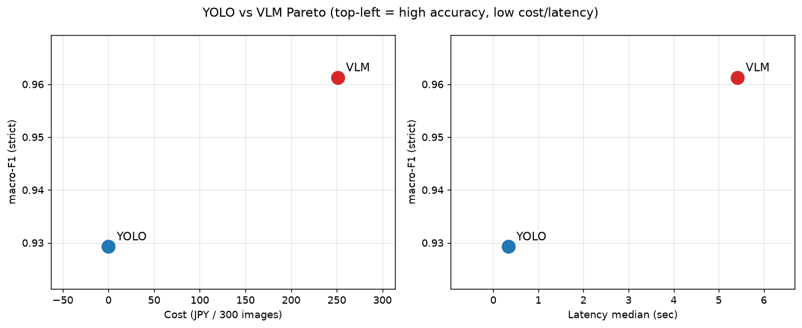
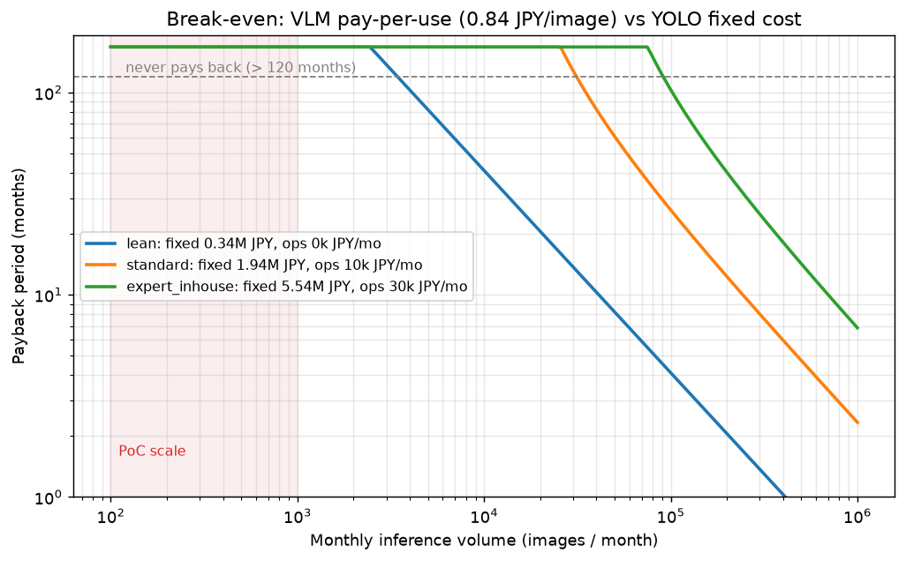

# 分析レポート — YOLO vs VLM 有無判定比較(N=300, COCO val2017)

> 対象: YOLO(`yolo26x`, COCO学習済み, ローカル)vs VLM(`gemini-3.5-flash`, temp=0)。
> 主比較は **しきい値調整した tuned YOLO@conf=0.075**(選定根拠は §2。既定 0.25 は不公平として退ける)。
> 同一評価セット(eval `289d6c0e`, N=300)・同一指標で比較。生データは `results/comparison_tuned.json` /
> `results/yolo_threshold.json`、各ランは `results/{run_id}.json`。再現: シード固定 + リクエストキャッシュ。

## 1. ヘッドライン

**妥当な閾値の範囲(conf 0.01〜0.10)の全域で、しきい値調整した YOLO は VLM と精度ほぼ互角(差は数 pt、対応あり検定で
有意差なし)。精度はこの範囲のどこを取っても互角であり、意思決定を支配するのはコスト(0 vs 251 円)と
レイテンシ(約 16 倍)。** 閾値の点推定は結論の前提ではなく、堅牢性の確認材料として §2 に置く。

> 注: 本比較で詰め切ったのは **YOLO 側の閾値のみ**。VLM 側のプロンプト感度は未測定で、
> 検証手続きと判定基準を §2b に事前登録してある(実行待ち)。

**結論は閾値選択に依存しない**(conf 0.01〜0.10 の範囲, 全300):

| 指標 | YOLO(conf 0.01〜0.10 での範囲) | VLM | 差 |
|---|---|---|---|
| macro-F1 (strict) | 0.921 – 0.945 | 0.961 | 1.6 – 4.0 pt |
| micro-F1 (strict) | 0.941 – 0.954 | 0.959 | 0.5 – 1.8 pt |
| item accuracy | 0.962 – 0.972 | — | ≈互角 |

主比較は標準操作点 **tuned YOLO@conf=0.075**(選定根拠は §2)。この点での対照:

| 指標(主比較 = tuned YOLO@0.075) | YOLO | VLM (Flash) | 差(VLM−YOLO, 画像単位ペア差CI95) |
|---|---|---|---|
| macro-F1 (strict) | 0.929 | 0.961 | +3.2pt [−0.4, +4.4]pt(有意差なし、McNemar p=0.71と一致) |
| micro-F1 (strict) | 0.954 | 0.959 | +0.5pt [−0.7, +1.6]pt |
| item accuracy | 0.972 | 0.974 | +0.2pt [−0.5, +0.9]pt |
| 個数 recall(副軸) | 0.927 | 0.871 | YOLO |
| uncertain 率 | 0.00% | 0.31% | §4 参照 |
| **コスト(円/300枚)** | **0** | 251 | **YOLO** |
| **レイテンシ中央値** | **0.33s** | 5.42s | **YOLO 約16倍速** |
| レイテンシ p95 | 0.52s | 7.87s | YOLO |

## 2. しきい値の選定と堅牢性(結論の前提ではなく確認)

**操作点 conf=0.075 は 3 つの独立な線が収束する点**で、VLM 比較とは無関係な基準のみで決めている
(「テストで選んでテストで報告した」批判を封じる):

1. **標準慣行**: 検出器の運用しきい値は F1 最大点(F1-conf カーブのピーク)を採るのが定石。
   overall(micro)-F1 と item accuracy はともに conf≈0.075 でピーク。
2. **リークなし分割検証**: 300 を tune(120)/test(180) に分割。tune 上で micro-F1・item accuracy を
   最大化する閾値はいずれも **0.075**(VLM を一切参照しない選定)。
3. **argmax 一致**: 全データの micro-F1・item accuracy の argmax も 0.075。

プラトーは平坦(conf 0.05〜0.10 で micro-F1 は 0.953〜0.954)なため近傍鈍感=頑健。

スイープ結果(`results/yolo_threshold.json`。`results/` は生成物のため未追跡。
`python -m src.analysis.yolo_threshold sweep --raw results/yolo_raw_detections.json --eval-set data/eval_set.json`
で再生成可能。再推論なしの後処理のみで無料):

| conf | macro-F1 | micro-F1 | item acc | 個数recall |
|---|---|---|---|---|
| 0.01 | 0.945 | 0.941 | 0.962 | 0.985 |
| **0.075(採用)** | 0.929 | **0.954** | **0.972** | 0.927 |
| 0.25(既定) | 0.906 | 0.934 | 0.961 | 0.767 |

**McNemar(対応あり, strict, tuned YOLO@0.075 vs VLM):**
- 全300: n01=30, n10=34, **p=0.71 → 有意差なし**。
- リークなし test(N=180): n01=22, n10=16, **p=0.42 → 有意差なし**。test では micro-F1 で YOLO が逆転
  (0.959 vs 0.954)。

**感度(他の閾値・指標でも結論不変):** macro-F1 を貪欲に最大化する点は conf=0.01(0.945)だが、これは
有無還元で IoU 由来の FP 罰則が無く recall に振れる退化点で、偽陽性が増えるため項目単位では VLM に
わずかに有意(全300で p=0.003)。逆に既定 conf=0.25 では取りこぼしで VLM が有意(p=0.004)。**いずれの
妥当な閾値でも精度差は数 pt 以内**で、結論(精度互角・決定はコスト/レイテンシ)は閾値選択に依存しない。

## 2b. VLM 側のプロンプト感度(手続きを事前登録・**未実行**)

§2 で詰めたのは YOLO の閾値だけで、VLM は `concise` 1 本のまま。**前編で論文に向けた
「片方だけデフォルト設定ではないか」という批判は、そのまま本作にも当たる。**

対称にできないのは探索空間の性質による(詳細は `docs/DESIGN.md` §4)。conf は [0,1] のスカラー
1 次元で全走査でき、1 点あたりのコストは 0(推論後のフィルタ)。プロンプトは次元も境界も無く
「全走査した」状態が原理的に存在せず、1 点ごとに N=300 の再推論(課金)が要る。**プロンプト側で
できるのは水準サンプリングだけ**で、これは免責ではなく前提条件の明示である。

そのうえで水準を 3 本振り、**結論が反転しないかだけ**を確認する。

| 水準 | 変えるもの | 狙い |
|---|---|---|
| `concise`(baseline) | 現行プロンプト | 現状の値 |
| `deliberate` | 項目ごとに `evidence` を先に書かせる | 「もっと考えさせれば上がる」で精度が動くか |
| `calibrated` | 過剰主張の抑制 + `uncertain` の使用基準の明示 | §3b の過剰主張 FP と §4 の uncertain 率 0.31% がプロンプト由来か |

**手続き**(YOLO の閾値選定と同一規則。実行前に固定)

1. §2 と同じ分割(seed=42, test_frac=0.6 → tune 120 / test 180)で **tune の micro-F1 が最大の
   水準を選び、test で報告**する。
2. 感度の主指標は**プロンプト間のばらつき(max−min)**。閾値を動かしたときの macro-F1 の振れ幅
   (§1: 0.921–0.945 = 2.4pt)と同じ土俵で並べる。
3. 選定水準と baseline の両方を、test 上で tuned YOLO@0.075 と対応あり比較する。

**事前登録した判定基準**(実行後に基準を動かさないため先に書く)

| 結果 | 対応 |
|---|---|
| 選定水準でも YOLO 比較が非有意のまま、かつばらつき ≤ 2.4pt | 結論不変。§1・§5・§7 を維持し「3 水準で確認済み」を追記 |
| 選定水準で VLM が test 上有意に上回る | §1 のヘッドラインと §7 の意思決定ルールを**書き換える** |
| ばらつきが 2.4pt を大きく超える | 「VLM の精度はプロンプト次第で数 pt 動く」を §6 の限界に格上げ |

**ステータス: 実装済み・未実行。** 本節に数値はまだ無い。追加コストは baseline 実測 251 円/ラン
から 2 水準で 500 円前後。再現コマンドは README、生データは `results/prompt_sensitivity.json`。

## 3. 誤り要因回帰(誤答 ~ 項目数 + bbox面積比 + crowd + gt_present, ロジスティック, n=2281)

主比較の tuned YOLO@0.075 と VLM:

| 要因(オッズ比) | YOLO@0.075 | VLM |
|---|---|---|
| gt_present | 2.43 [1.47, 4.03] p=0.0006 | 2.25 [1.34, 3.79] p=0.002 |
| min_bbox_area_ratio | 0.049 [0.002, 1.05] p=0.054 | 0.002 [0.000, 0.40] p=0.021 |
| n_items | 1.03 p=0.68 | 0.88 p=0.11 |
| has_crowd | 0.74 p=0.49 | 0.39 p=0.12 |

**しきい値を公平に合わせると失敗モードも収束する:** tuned YOLO@0.075 と VLM はともに
(1) present 項目で誤りやすく(OR≈2.3〜2.4、見逃し寄り)、(2) 小物体で誤る(面積比 OR≪1)、と
ほぼ同型。**両モデルの弱点は「小さく写った present の取りこぼし」で一致**する。

> 参考(既定 conf=0.25 の YOLO): gt_present OR=**16.6**(p≈1e-17)と極端な見逃し律速に見えるが、
> これは閾値が高すぎた産物。conf を下げると OR は 2.4 まで縮み、VLM と同水準になる。
> 「専用検出器は見逃しに偏る」という見かけの結論自体が、既定しきい値のアーティファクトだった。

**クラスタ頑健SEでの再確認**: 画像レベル定数の `min_bbox_area_ratio` は補正で標準誤差が拡大し、
YOLO@0.075 は p=0.054→0.198(元々非有意)、VLM は p=0.021→0.030(有意は保つが境界線)。
一方 `gt_present` は項目単位で変動する変数のため逆に p 値が縮む(例 YOLO@0.25: p≈1e-17→5e-20)。
オッズ比そのものは補正の影響を受けない(SE/p値のみ変化)。

### 3b. 誤り taxonomy(strict, tuned YOLO@0.075, `results/error_taxonomy.json`)

| バケット | YOLO@0.075 | VLM | 読み |
|---|---|---|---|
| missed_present(見逃し) | 34 | 28 | ほぼ同等(既定0.25では YOLO=77) |
| fp_confusable(混同ペアで過剰主張) | 17 | 11 | YOLO がやや多い |
| fp_other(その他の偽陽性) | 13 | 14 | 同等 |
| uncertain_on_present | 0 | 4 | VLM のみ |
| uncertain_on_absent | 0 | 3 | VLM のみ |
| **合計誤答** | **64** | **60** | ほぼ同数 |

しきい値を公平に合わせると、誤りの内訳も件数も近づく(合計 64 vs 60)。専用検出器の
「見逃し vs 過剰主張」はしきい値で連続的に動かせるのが本質で、VLM にはこの運用ノブが無い
(§4 の uncertain 非活用と対をなす差)。混同ペア FP は YOLO(17)>VLM(11)で、低しきい値で
紛らわしい物体を拾う YOLO と、チェックリスト事前情報で過剰主張する VLM が別経路で同程度の混同を起こす。

代表例(`results/error_taxonomy.json` に各5件):
- YOLO 混同FP: 低しきい値で紛らわしい物体を present に拾う(混同ペアで negative 化したカテゴリ)。
- VLM 過剰主張: img80340 `potted plant`(area=0.0007, "plant in a pot in background")— 背景の微小物体。
- VLM uncertain: img82688 `cell phone`("possible phone holster on belt")— 妥当な難ケースで abstain。

## 4. uncertain について(方針 A)

VLM の uncertain 率は **0.31%(7/2281)**。プロンプトで「迷ったら uncertain」と明示しても
ほぼ present/absent に振り切る。7 件はすべて小物体・ぼやけ・遮蔽の妥当な難ケース(cell phone,
tie, knife×2, backpack, handbag, truck)で、出すべき所では正しいが**頻度が極端に低い**。

→ **汎用 VLM は uncertain という出口を持つが、校正された不確実性としてはほぼ使わない(過信)。**
このため abstain ベースの risk-coverage 運用(uncertain を人間に回して危険誤り率を下げる)は
実質成立しない。YOLO は conf 閾値で coverage を連続的に振れる(運用で危険誤り率とカバレッジを
トレードできる)のと**非対称**。この差自体が「専用検出器を差し込む価値」の一論点になる。

## 5. パレート / 運用上の示唆



精度(縦, tuned YOLO@0.075)× コスト・レイテンシ(横)。精度差はこの範囲内で数 pt・有意差なし(§2)。
YOLO は左下(無料・低レイテンシ)、VLM は右上(同等精度だが有料・高レイテンシ)。

**意思決定(問い「汎用 VLM のシステムに専用検出器 YOLO を差し込む価値があるか」への回答):**
- **精度は妥当な閾値のどこを取っても互角**(どの閾値・指標でも差は数 pt、McNemar 有意差なし)。よって
  **判断は精度ではなくコスト・レイテンシが支配**する。YOLO は無料・約16倍速 → **閉語彙の有無判定で
  大量・低コスト・低レイテンシが要件なら、専用検出器を差し込む価値は十分ある**。
- **VLM が優位な点(精度以外)**: open-vocabulary(COCO 外カテゴリ)、自然言語の根拠・追加質問。
  「不確実性の表明」は名目上の利点だが §4 のとおり実際にはほぼ使わない。語彙の柔軟性や説明性が
  要件なら VLM、という棲み分け。
- **運用ノブの非対称**: YOLO はしきい値で recall/precision・coverage を連続調整できるが、VLM は
  離散的にほぼ全件を確信で返す。リスク運用(危険誤り率の制御)では YOLO 側が扱いやすい。
- **ハイブリッド示唆**: 両モデルの弱点は「小物体の取りこぼし」で一致(§3)。YOLO を一次スクリーニング、
  低信頼・小物体のみ VLM に回す二段構成で、コストと精度の中間点を取れる可能性(将来検証)。

## 5b. 損益分岐 — 「YOLO は 0 円」は API 課金が 0 という意味でしかない

§1 のコスト欄の 0 は **API 課金が 0** という意味で、実際には**アノテーション・学習工数・運用**が
固定費として先に立つ。実務の選定で効くのは**固定費先行(YOLO)と従量課金(VLM)の交点**である。

```
YOLO 累計(T ヶ月) = C_fix + 運用月額 × T
VLM  累計(T ヶ月) = 0.84 円/枚 × 月間枚数 M × T
C_fix = ラベル枚数 × 1枚あたり矩形数 × 矩形単価 × 手戻り係数 + 学習工数 × 時間単価
```

VLM の 0.84 円/枚 は実測(251 円 ÷ 300 枚)。YOLO の固定費は環境依存で測れないので、点推定を
狙わず**公開値の中で最も安い条件 = YOLO に最も有利な下限**を置く。下限で結論が出れば実際の条件は
高くなる方向にしか動かない(a fortiori)。上振れは固定費 ×3 / ×10 の感度で確認する。想定は
チェックリスト 10 項目(= 検出クラス 10、付録の配管デモと同規模)。

| 項 | 置いた値(下限) | 実際にはこちらに動く |
|---|---|---|
| 矩形単価 | 5.8 円($0.036/object, クラウドソーシング最安) | 国内外注 10 円〜 / 有識者の内製 ≒35 円(42 秒 × 時給 3000 円) |
| ラベル枚数 | 3,000 枚(10 クラス × 300 枚) | Ultralytics 推奨(≧1500 枚/クラス)なら 15,000 枚 |
| 運用月額 | 0 円(既存基盤に相乗り) | 専用の推論サーバ・監視を持てば月数万円 |

→ 固定費 **344,400 円**(ラベル 104,400 + 学習工数 240,000)、損益分岐は**累計 411,633 枚**。

**回収期間**(「回収不能」= VLM の月額 ≤ YOLO の運用月額で交点が存在しない、または 120 ヶ月超):

| 固定費 | 500 枚/月 | 5,000 枚/月 | 50,000 枚/月 | 500,000 枚/月 |
|---|---|---|---|---|
| **下限(×1) 34 万円** | **回収不能** | 82.3 ヶ月 | 8.2 ヶ月 | 0.8 ヶ月 |
| ×3(103 万円) | **回収不能** | **回収不能** | 24.7 ヶ月 | 2.5 ヶ月 |
| ×10(344 万円) | **回収不能** | **回収不能** | 82.3 ヶ月 | 8.2 ヶ月 |



**読み**

- **PoC 規模(月 数百〜数千枚)では、最も安い条件でも回収できない**(月 500 枚なら約 68 年)。
  「PoC だから VLM」は感想ではなく桁で言える結論になる。
- **月 5 万枚を超えると景色が変わる**(下限ケースで 8 ヶ月)。見直しの目安は**月間 1 万枚のオーダー**。
- **固定費を 10 倍に振っても向きは変わらない**(図の 3 本は平行移動するだけ)。効くのは固定費の
  絶対値ではなく**推論量の桁**で、単価の見積もりを精密にしても意思決定は動かない。

**限界**: 精度互角(第一象限)が前提で、語彙外(§7)では交点が存在しない / ラベル N 枚で目標精度に
届く保証は未検証(fine-tuning はスコープ外、§6)/ 手戻り係数・工数・運用費・時給は出典のない仮定。
前提値は `conf/costs.yaml` に出典付きで外出しし、`python -m src.analysis.breakeven` で再計算できる
(API 不要)。出典: [SageMaker Ground Truth](https://aws.amazon.com/sagemaker-ai/groundtruth/pricing/) /
[国内相場](https://ai-market.jp/ai_price/annotation-fee/) /
[42 秒/矩形](https://arxiv.org/abs/1602.08405) /
[Ultralytics](https://docs.ultralytics.com/yolov5/tutorials/tips-for-best-training-results)。

## 6. 限界・脅威

- 閉語彙(COCO 80 クラス)に限定。open-vocabulary では YOLO 側が原理的に不利になり結論は変わりうる。
- VLM は単一プロバイダ・単一プロンプト(`concise`)・temp=0 の 1 ラン。**プロンプト感度は未測定**(§2b に手続きと判定基準を事前登録済み、実行待ち)。YOLO の閾値は全走査したのに VLM は 1 点しか見ていない探索の非対称が、本作の最大の弱点。
- localization のフル IoU 照合はスコープ外(有無判定に揃える設計判断)。個数 recall は近似副軸。
- レイテンシはネットワーク・地域・時間帯依存の単発計測。中央値/p95 を採用(平均は外れ値に弱い)。
- しきい値は単一スカラのため tune/test 分割で選定したが N=180 と小さく検出力は限定的。
  「有意差なし」は同等の証明ではなく「N=180 では差を検出できない」の意。
- **YOLO のファインチューニングは本研究では行わない**: 対象 YOLO は既に COCO 学習済みで評価も
  COCO val のため、ここで追加学習するとテストセット汚染になり無効。ファインチューニングが効くのは
  ドメイン固有データ(専門ドメインの対象物)であり、本作のスコープ外。ドメイン適用時の将来課題とする。
- クラスタ構造(画像内の項目の非独立性)は §3 で補正確認済み。VLM の `min_bbox_area_ratio` のみ
  境界線(p=0.030)で、他の結論は不変

## 7. 意思決定ルール(まとめ)— 二象限

本作の問い「汎用 VLM のシステムに専用検出器 YOLO を差し込む価値があるか」への答えは、
**タスクがどの象限にあるかで決まる**。精度の優劣ではない。

| | 第一象限:閉語彙・ラベルあり(本ベンチ COCO) | 第二象限:語彙外・ラベル無し(例: 配管施工) |
|---|---|---|
| YOLO | **互角・無料・約16倍速**(調整すれば精度差なし) | **構造的に判定不能**(対象が検出語彙に無い・付録) |
| VLM | 同等精度だが有料・低速 | **ゼロショットで唯一動く**(判定+根拠) |
| 推奨 | **調整 YOLO**(または高スループット要件で YOLO) | **VLM 一択** |

- 第一象限では「精度は妥当な閾値のどこを取っても互角(§2)→ コスト・レイテンシが支配 → 調整 YOLO で十分」。
  ただし**第一象限の中でも推論量で判断は割れる**: 月 数百〜数千枚(PoC 規模)では YOLO 側の
  固定費を回収できず VLM が安い。切り替えの目安は**月間 1 万枚のオーダー**(§5b)。
- 第二象限では「対象物が COCO 語彙に無く(付録: 10 項目中 9 項目が語彙外)、学習/調整用ラベルも
  無い → 専用検出器は土俵に上がれず、汎用 VLM がゼロショットで動く現実解」。
- **「ラベルがあれば YOLO も学習できる」への先回り**: そのとおり。だが第二象限の定義はまさに
  **そのラベルが無い/集めにくい**こと(§6 のファインチューニング注と同根)。ゆえにゼロショットの
  汎用モデルが現実解になる。二つの結論は矛盾せず、**一つの意思決定ルールの両輪**である。

---

（以下、付録は `report/construction_demo_section.md` の自動生成内容を統合したもの）

## 付録: 建設ドメインでの適用可能性デモ(定性)

> 本ベンチ(COCO)は YOLO の本拠地で、調整済み YOLO は VLM と精度互角・無料・高速だった。では専門ドメイン(建設)は? 対象物が検出器の語彙に無く、学習/調整用ラベルも無い。ここでは専用 YOLO は土俵に上がれず、汎用 VLM がゼロショットで動く唯一の選択肢になる。**正解ラベルが無いため精度比較ではなく『適用可能性』の定性実証**(F1・有意差は出さない)。

### YOLO の語彙ギャップ(推論不要・クラス一覧から確定)

建設チェックリスト 10 項目のうち、COCO 80 クラスに**無い**項目は **9 件(90%)**。これらは COCO 学習済み YOLO が conf 値によらず**絶対に present を出せない**= 構造的に判定不能。

- YOLO 語彙内: person
- YOLO 語彙外(判定不能): pipe, flange, tee fitting, elbow fitting, valve, gasket, bolted flange joint, pipe support, pressure gauge

### 画像ごとの判定

#### Flange01.jpg

> 出典: Wikimedia Commons / © 1971markus@wikipedia.de / CC BY-SA 4.0 — https://commons.wikimedia.org/wiki/File:Kokerei_Hansa_(08).jpg

| カテゴリ | 語彙 | YOLO | VLM 判定 | 根拠 |
|---|---|---|---|---|
| person | 内 | absent | absent | no people visible |
| pipe | **外** | 判定不能 | present×4 | multiple rusty metal pipes |
| flange | **外** | 判定不能 | present×6 | circular flanges on pipe joints |
| tee fitting | **外** | 判定不能 | present×1 | Y-branch tee fitting on main pipe |
| elbow fitting | **外** | 判定不能 | present×1 | 90-degree elbow bend on left pipe |
| valve | **外** | 判定不能 | absent | no valves visible |
| gasket | **外** | 判定不能 | uncertain | gaskets inside joints are not clearly visible |
| bolted flange joint | **外** | 判定不能 | present×3 | bolted flange connections visible |
| pipe support | **外** | 判定不能 | uncertain | no clear pipe supports visible |
| pressure gauge | **外** | 判定不能 | absent | no pressure gauges visible |

#### Piping01.jpg

> 出典: Wikimedia Commons / Markus Schweiss / CC BY-SA 3.0 — https://commons.wikimedia.org/wiki/File:Piping01.JPG

| カテゴリ | 語彙 | YOLO | VLM 判定 | 根拠 |
|---|---|---|---|---|
| person | 内 | absent | absent | no people visible in the image |
| pipe | **外** | 判定不能 | present×5 | multiple metal pipe spools on the pallet |
| flange | **外** | 判定不能 | present×9 | multiple circular flanges on the pipe ends |
| tee fitting | **外** | 判定不能 | present×1 | tee branch fitting in the center |
| elbow fitting | **外** | 判定不能 | present×5 | curved elbow sections on the pipes |
| valve | **外** | 判定不能 | absent | no valves visible on the pipes |
| gasket | **外** | 判定不能 | absent | no gaskets visible |
| bolted flange joint | **外** | 判定不能 | absent | no bolted flange connections visible |
| pipe support | **外** | 判定不能 | present×1 | metal support bracket welded to center pipe |
| pressure gauge | **外** | 判定不能 | absent | no pressure gauges visible |

#### Piping02.jpg

> 出典: Wikimedia Commons / U.S. Fish & Wildlife Service - Pacific Region / CC BY 2.0 — https://commons.wikimedia.org/wiki/File:Piping_system_at_Makah_National_Fish_Hatchery_(5837252675).jpg

| カテゴリ | 語彙 | YOLO | VLM 判定 | 根拠 |
|---|---|---|---|---|
| person | 内 | absent | absent | no people visible |
| pipe | **外** | 判定不能 | present×12 | multiple large blue and green pipes |
| flange | **外** | 判定不能 | present×20 | many circular flanges on pipes |
| tee fitting | **外** | 判定不能 | present×4 | tee junctions on vertical pipes |
| elbow fitting | **外** | 判定不能 | present×5 | curved elbow pipes near bottom |
| valve | **外** | 判定不能 | present×4 | valves with blue cylindrical actuators |
| gasket | **外** | 判定不能 | uncertain | gaskets are sandwiched inside flange joints |
| bolted flange joint | **外** | 判定不能 | present×15 | bolted flange connections |
| pipe support | **外** | 判定不能 | present×3 | support feet under bottom pipes |
| pressure gauge | **外** | 判定不能 | present×1 | dial pressure gauge on bottom pipe |

#### Piping03.png

> 出典: Wikimedia Commons / Wikikart99 / CC0 1.0 — https://commons.wikimedia.org/wiki/File:A_UPW_Installation_using_PVDF_Piping.png

| カテゴリ | 語彙 | YOLO | VLM 判定 | 根拠 |
|---|---|---|---|---|
| person | 内 | absent | absent | No people are visible in the image |
| pipe | **外** | 判定不能 | present×50 | Numerous white plastic pipes throughout the system |
| flange | **外** | 判定不能 | present×25 | Many circular flanges connecting pipe segments |
| tee fitting | **外** | 判定不能 | present×12 | T-shaped pipe connectors visible on lines |
| elbow fitting | **外** | 判定不能 | present×10 | 90-degree curved pipe elbows visible |
| valve | **外** | 判定不能 | present×18 | Orange and black control valves on pipes |
| gasket | **外** | 判定不能 | present×15 | Reddish sealing gaskets visible at joints |
| bolted flange joint | **外** | 判定不能 | present×12 | Flanges secured with bolts, especially top right |
| pipe support | **外** | 判定不能 | present×15 | Stainless steel framing supporting the piping network |
| pressure gauge | **外** | 判定不能 | absent | No dial pressure gauges are visible |

#### Piping04.jpg

> 出典: Wikimedia Commons / Audriusa / CC BY-SA 3.0 — https://commons.wikimedia.org/wiki/File:Pipeline_device.jpg

| カテゴリ | 語彙 | YOLO | VLM 判定 | 根拠 |
|---|---|---|---|---|
| person | 内 | absent | absent | no people visible |
| pipe | **外** | 判定不能 | present×5 | multiple metal and flexible pipes |
| flange | **外** | 判定不能 | present×4 | circular pipe flanges visible |
| tee fitting | **外** | 判定不能 | present×2 | T-junctions on the piping system |
| elbow fitting | **外** | 判定不能 | present×2 | curved elbow pipe sections |
| valve | **外** | 判定不能 | present×3 | valve wheel and handles visible |
| gasket | **外** | 判定不能 | uncertain | gaskets inside joints are not clearly visible |
| bolted flange joint | **外** | 判定不能 | present×3 | bolted flange connections visible |
| pipe support | **外** | 判定不能 | present×2 | concrete blocks supporting the pipes |
| pressure gauge | **外** | 判定不能 | absent | no pressure gauges visible |

### 読み

COCO 学習済み YOLO は語彙外カテゴリ(flange/tee fitting/valve 等の配管部品)に対し**原理的に present を返せない**(検出クラスに存在しない)。一方 VLM は同じ画像・同じチェックリストにゼロショットで判定と根拠を返す。COCO ベンチの結論「語彙内・ラベルありなら調整 YOLO で十分」と、本デモの「語彙外・ラベル無しなら VLM 一択」は**矛盾せず、一つの意思決定ルールの両輪**である。
